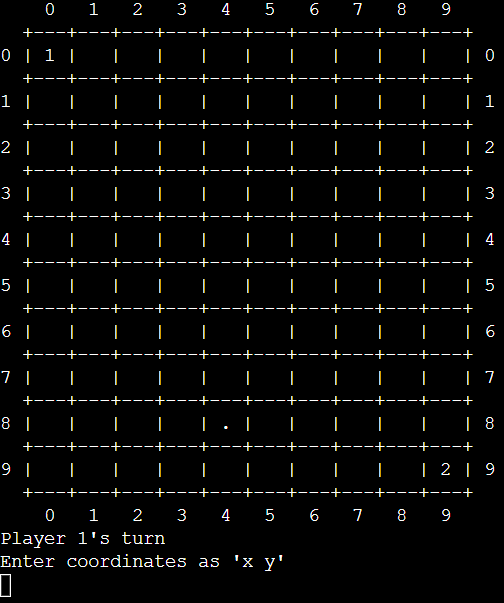
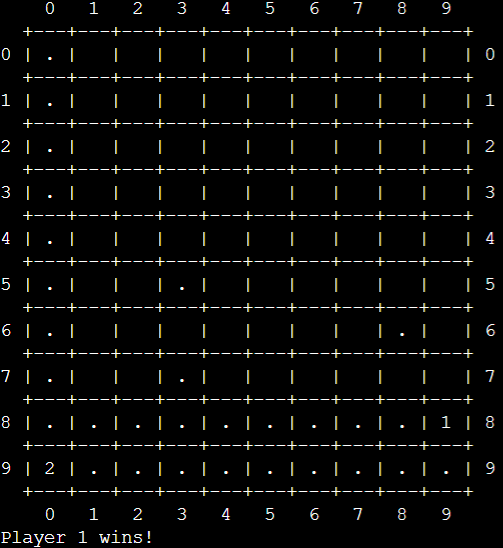

<h1 align="center">Block Off</h1>

"Block Off" is a two player game where the goal is to force your opponent to run out of moves. Players move laterally across the board, leaving behind barriers. These barriers cannot be traversed, allowing them to block off players. Trap your opponent and avoid running out of room to win.

I built Block Off using Java as a project for my AP CSA class. Have fun playing!

Play at https://onlinegdb.com/JyOOkVSMK

  
  

